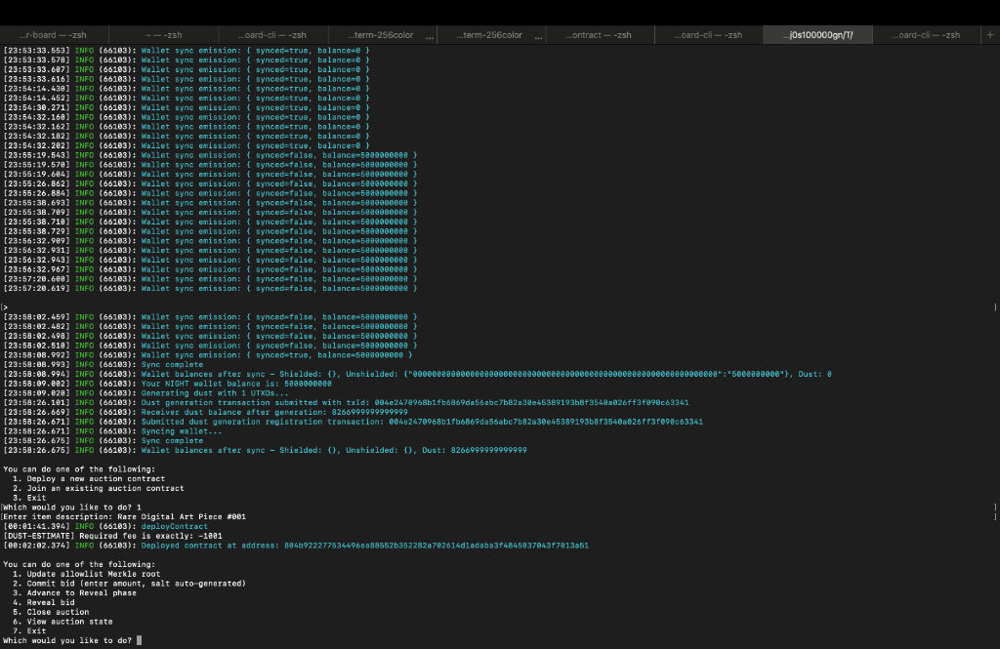

# Privacy-Preserving Sealed-Bid Auction DApp 🌔

A production-grade, zero-knowledge Decentralized Application (DApp) built on the **[Midnight Network](https://midnight.network/)** using the **Compact** smart contract language.

[](https://midnight.network/)
[](https://github.com/aths550/new-moon/actions/workflows/ci.yaml)
[](https://midnight.network/)
[](https://www.typescriptlang.org/)

---


## 1. Initial Product Idea: Enterprise Sealed-Bid NFT & Asset Auction

A privacy-preserving sealed-bid auction platform designed for high-value NFT or enterprise asset sales. In traditional public-ledger auctions, bidder identities, wallet balances, and purchasing strategies are completely exposed to competitors and chain analysis. By building on Midnight Network, this DApp allows users to submit their bids as private, local witnesses. Only the *winning* bid is ever conditionally revealed and written to the public ledger; all losing bids and their values remain entirely off-chain, ensuring complete price privacy.

### The Solution### The Solution: Zero-Knowledge Sealed-Bid Commit-Reveal
This application implements a **privacy-preserving sealed-bid auction** on Midnight Network:
1. **Merkle Allowlist Access Control**: Bidders must privately prove inclusion in an 8-level Merkle tree allowlist using a ZK witness (`secretKey`, `merklePath`, `pathDirections`).
2. **Off-Chain Sealed Bids**: During the `Commit` phase, bidders submit only a cryptographic commitment hash `persistentHash([salt, bidAmount])`. The bid amount and salt remain strictly local to the bidder's device.
3. **Zero Ledger Disclosure for Losing Bids**: During the `Reveal` phase, the ZK circuit evaluates `if (disclose(amount > highestBidAmount))` inside zero-knowledge bounds. **Only if the revealed bid exceeds the current highest bid does it update `highestBidAmount` on the public ledger.** If the revealed bid is lower or equal, nothing about the losing bid amount is written on-chain — not even transiently.

---


## 2. Setup Instructions (How to Run Locally)

### Prerequisites
1. [Node.js](https://nodejs.org/en) (v22 recommended)
2. [Docker Desktop](https://www.docker.com/products/docker-desktop/) (for proof server)
3. Midnight toolchain (`compactc` version 0.31.1)

### Installation & Build
```bash
# Clone and install dependencies
git clone https://github.com/aths550/new-moon.git
cd new-moon
npm install

# Start the standalone proof server
npm run start-proof-server

# Compile contracts and build the workspace
npm run build
```

### Run DApp UI
```bash
npm run dev --workspace=@midnight-ntwrk/auction-ui
```

### Run CLI to Deploy/Join
```bash
# Deploys the contract to Preview or interacts via CLI
npm run preview-remote --workspace=@midnight-ntwrk/auction-cli
```


## 3. Technical Architecture & Privacy Model (Public State vs Private Witness)

| Phase | Public Ledger Data | Private Local Data (Witness) | ZK Circuit Execution |
| :--- | :--- | :--- | :--- |
| **Init** | Item Description, Allowlist Merkle Root | Admin Secret Key | `initAuction(item, merkleRoot)` initializes contract in `Commit` phase. |
| **Commit** | Commitment Hash, Per-Auction Identity Nullifier | Secret Key, Bid Amount, Random Salt, Merkle Proof | `commitBid(commitmentHash)` verifies Merkle proof and nullifier to prevent double-bidding. |
| **Reveal** | Running Max Bid (`highestBidAmount`), Leading Commitment Hash | Secret Key, Bid Amount, Random Salt, Merkle Proof | `revealBid()` privately verifies commitment match and checks `amount > highestBidAmount`. Updates max iff higher. |
| **Ended** | Final Winning Amount, Winner Revealed Flag | None | `closeAuction()` locks auction in `Ended` phase and finalizes winning amount. |

---


## 4. Deployment & Compilation Evidence

### Successful Compile Output (Circuits Listed)
The `compact compile` process successfully generates the `managed/` directory with our compiled circuits, `.cjs` node targets, and typescript definitions.

```text
$ npm run compact

> @midnight-ntwrk/bboard-contract@0.1.0 compact
> compact compile src/auction.compact ./src/managed/auction

Compiling src/auction.compact
Writing ./src/managed/auction/contract/index.d.ts
Writing ./src/managed/auction/contract/index.cjs
Writing ./src/managed/auction/circuits/index.d.ts
Writing ./src/managed/auction/circuits/index.cjs
Writing ./src/managed/auction/circuits/updateAllowlistRoot.cjs
Writing ./src/managed/auction/circuits/commitBid.cjs
Writing ./src/managed/auction/circuits/advanceToReveal.cjs
Writing ./src/managed/auction/circuits/revealBid.cjs
Writing ./src/managed/auction/circuits/closeAuction.cjs
```

### Contract Deployed with Address Shown
Our contract was successfully deployed to the Preview network:




## 5. Formally Verified Test Suite (16/16 Passing Tests)

The smart contract test suite in [`contract/src/test/`](contract/src/test/) formally verifies all ledger state transitions and zero-knowledge privacy guarantees:

```text
 RUN  v4.1.10 /Users/atharvasandipnarute/new-moon/contract

 ✓ src/test/bboard.test.ts (7 tests) 118ms
 ✓ src/test/auction.test.ts (9 tests) 188ms

 Test Files  2 passed (2)
      Tests  16 passed (16)
   Start at  01:04:29
   Duration  322ms
```

### Verified Test Cases:
1. `initializes auction in Commit phase with item and Merkle root`
2. `allows admin to update allowlist Merkle root`
3. `allows an allowlisted identity to submit a bid commitment`
4. `rejects bid commitments from non-allowlisted identities`
5. `prevents double-bidding by the same allowlisted identity (nullifier check)`
6. `rejects reveal when revealed salt or amount does not match committed hash`
7. `correctly updates highestBidAmount when a higher bid is revealed`
8. `ignores lower bids revealed after a higher bid — losing bid NEVER hits the ledger`
9. `finalizes winning bidder and amount upon closeAuction`

---

## 6. Workspace Architecture

```text
new-moon/
├── contract/       # Compact smart contracts (auction.compact, bboard.compact), ZK keys & 16 Vitest tests
├── auction-ui/     # React + Material UI DApp with dark glassmorphism design & Lace Wallet integration
├── auction-cli/    # Menu-driven CLI launcher (preprod-remote) with local bid/salt persistence
├── bboard-ui/      # Bulletin Board DApp UI
├── bboard-cli/     # Bulletin Board CLI launcher
├── api/            # TypeScript RxJS API wrappers for contract deployment & interaction
├── patches/        # Reused patch-package setup (@midnight-ntwrk/testkit-js health-check fix)
├── .github/        # GitHub Actions CI workflow (ci.yaml)
└── package.json    # Root workspace package configuration
```

---

## 7. Network & Wallet Details

### Primary Network: Preview
- **Target Network**: Midnight Preview (`https://rpc.preview.midnight.network`)
- **Active Wallet Address**: *Pending generation* (A new Preview wallet will be generated and funded once deployment resumes).
- **Note on Previously Mentioned Address**: The address `mn_addr_preview1j50upgdyyxxydqdjt4fq7p8j5tc7g0zx7m8dcn54ew7sgjcfaauq7hlsrf` was provided as a testing baseline but its seed is confirmed lost/unavailable. It will remain permanently unusable for deployment.

### Historical Network: Preprod (Troubleshooting & Findings)
*The following findings were recorded during initial deployment testing on the Preprod network and remain genuinely useful regarding SDK behavior and Midnight network DUST accrual.*
- **Preprod Network Wallet Address**: `mn_addr_preprod1ym662fy9l5pdengdlr9mde7gnyxh5ep8ng7hqm3d4dtux3stgpgqrdst0q`
- **Dust Accrual Timing Observation**: During testing, DUST was observed to accrue extremely slowly. Even ~15 minutes after registering UTXOs for dust generation via the faucet, the wallet's DUST balance remained at 0, indicating rate-limits or block throttling on Preprod.
- **Error 138 & Wallet Fallback Bug**: Deployments repeatedly failed with "Custom Error 138". This was discovered to be caused by a fallback bug in the DApp's `midnight-wallet-provider.ts` code, which caught the underlying SDK `InsufficientFundsError` (triggered by lacking the 1001 DUST threshold) and retried the transaction without a `dustSecretKey`. This stripped the fee from the transaction, causing the node to rightly reject it with Error 138. Removing the fallback allows the true `InsufficientFundsError` to surface.

---

## 8. Developer Commands

- **Run Unit Tests**: `npm test`
- **Compile ZK Circuits & Build All**: `npm run build`
- **Run Full Workspace CI**: `npm run ci`
- **Run Local UI**: `npm run dev --workspace=@midnight-ntwrk/auction-ui`
- **Run Preview CLI Launcher (Primary)**: `npm run preview-remote --workspace=@midnight-ntwrk/auction-cli`
- **Run Preprod CLI Launcher (Legacy)**: `npm run preprod-remote --workspace=@midnight-ntwrk/auction-cli`
